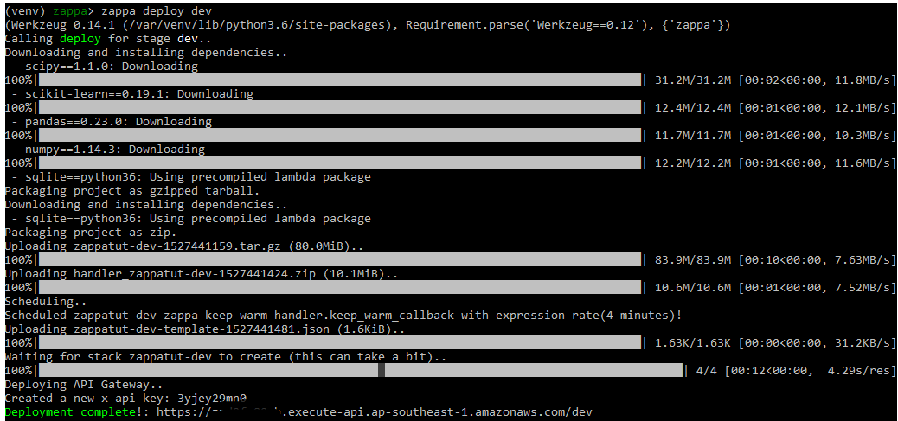

## Overview 
This is an early api prototype made for an automated visitor/employee registration system using facial
recognition which I had in mind. This api is built on top of Microsoft Face Api. It only requires a single api call for the following
- registering users
- identifying users
- deleting users

and also has the following additional features
- ensure user is only registered once in its own group (meaning Face Api only keeps a single person id
for the user)
- detect if the person in the image has registered in a certain person group is specified. if person group is not
specified, then it will check person against all person groups.

## Use Cases  
This api can be implemented over the various use cases: 
- Registering people and authenticating them using their faces

## How to deploy the api
**Prerequisites:**
- Microsoft Face Api Key
- Azure Table Storage Key
- Azure Table Storage Table

### 1) Create an external environment config file
Create a file config.ini and save it to folder regident/config/config.ini.
Fill it with the contents below.
```
[DEFAULT]
FACEAPI_KEY = 
FACEAPI_BASEURL = https://<region>.api.cognitive.microsoft.com/face/v1.0
FACEAPI_REGION = 
AZURESTORAGE_KEY = 
AZURESTORAGE_CONNECTIONSTRING = 
AZURESTORAGE_ACCTNAME = 
AZURESTORAGE_TABLENAME = 
```

### 2) Set up the virtual environment
```powershell
python -m venv venv
call venv/Scripts/activate.bat
pip install -r requirements.txt
```

### 3) Deploy the Flask Api to AWS using Zappa

```powershell
del /S *.pyc
zappa deploy dev
```
  

The site is now live at the url printed in the console! 
Check out this article for more info on how to deploy:  

https://medium.com/@houdinisparks/how-i-build-an-authenticated-serverless-flask-api-with-zappa-and-docker-for-a-model-582fc48fa0e0  

## How to use the api

#### Person
- Create person: `POST /api/v1/person`
    - Content-Type: multipart/form-data:  
        - <str:id>
        - <str:persongroupid>
        - <str:name>
        - <file:images>
- Get person's details: `GET /api/v1/person?id=<int:id>` 
- Add face to person: `PUT /api/v1/person?id=<int:id>&persongroupid=<int:persongroupid>`
    - Content-Type: multipart/form-data:  
        - <file:images>
- Remove person: `DELETE /api/v1/person?id=<int:id>&persongroupid=<int:persongroupid>`

#### PersonGroup
- Create person group: `POST /api/v1/persongroup`
    - Content-Type: multipart/form-data:
        - <str:persongroupid>
        - <str:name>
        - <str:data>
- Get person group details: `GET /api/v1/person?persongroupid=<int:persongroupid>`
- Delete person group `DELETE /api/v1/person?persongroupid=<int:persongroupid>`

#### Identify
- Identify image for person: `POST /api/v1/identify`
    - Content-Type: multipart/form-data:
        - <float:threshold>
        - <int:max_candidates_return>
        - <str:persongroups>
        - <file:image>

## Future Implementations:
- Save faces to azure blob storage
- Have more friendly http error codes. Now is just using the Azure http error codes.

 